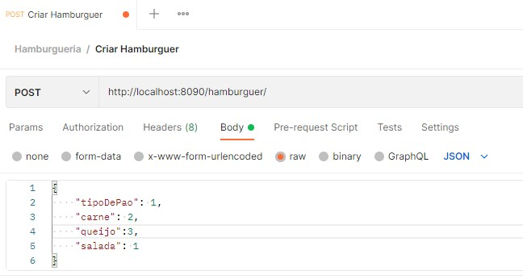
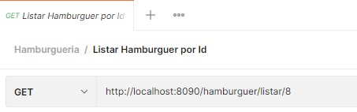
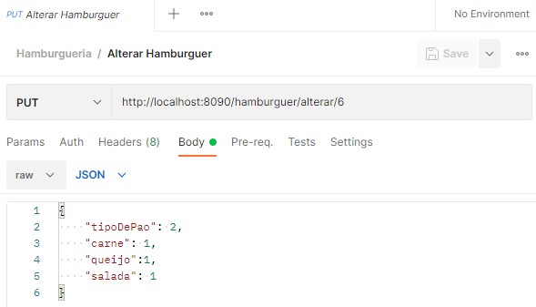
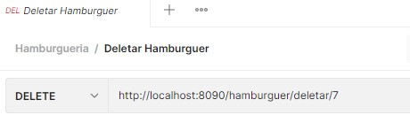
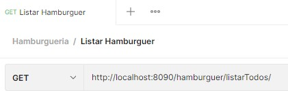
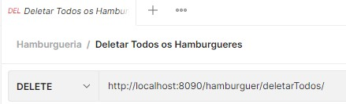

# API REST - :hamburger: SANTA HAMBURGUERIA :hamburger:

## Api premite que você:
|Função                                 |        Rota local                               |
|---------------------------------------|-------------------------------------------------|
| crie um hambúrguer                    |  http://localhost:8090/hamburguer/              |
| liste todos os hambúrgueres criados   |  http://localhost:8090/hamburguer/listaTodos/   |
| buscar Hamburguer Por Id              |  http://localhost:8090/hamburguer/listar/{id}   |
| alterar um hambúrguer Por Id          |  http://localhost:8090/hamburguer/alterar/{id}  |
| deletar um hambúrguer Por Id          |  http://localhost:8090/hamburguer/deletar/{id}  |
| deletar todos os hambúrgueres criados |  http://localhost:8090/hamburguer/deletarTodos/ |

## Tecnologias Utilizadas

 - Kotlin
 - SpringBoot
 - PostgreSql
 - Maven

## Modelo Arquiterura

 - MVC

## Como rodar a aplicação localmente

## Como testar

### POST

### GET/{id}

### PUT/{id}

### DELETE/{id}

### GET

### DELETE
